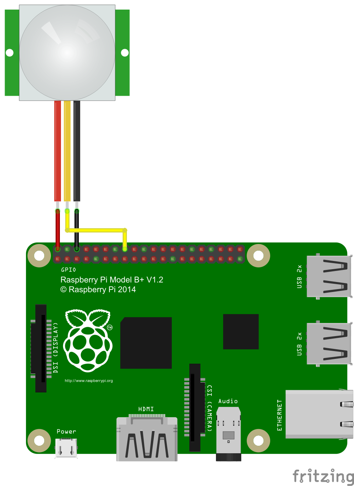

# Monitor Aktivierung
Aktiviert den Monitor, wenn dieser sich im Standby Modus befinden sollte.

Zur Realisierung der Aktivierungsfunktion wird ein Bewegungsmelder eingesetzt. Bei Erkennung einer Bewegung triggert das Programm die Aktivierung des Monitors.

Als Sensor wird ein HC-SR501 eingesetzt. Es ist jedoch auch jeder x-beliebige PIR Sensor möglich.

## Bewegungsmelder PIR

### PIR anschließen



- VCC an Pin 2 (5V)
- OUT an Pin 8 (GPIO 14)
- GND an Pin 6 (Ground)

***Jumper SW1 bzw. MD:*** Triggerverhalten von Out (Data):
- ***Position H:*** Data wird aller einer Sekunde auf High gesetzt bei Bewegungserkennung
- ***Position L:*** Data beibt auf High, solange eine Bewegung erkannt wird (Empfehlung)

### PIR Einstellungen
- ***Stellschraube Sx (Sensitive):*** Sensitivität der Bewegungserkennung
- ***Stellschraube Tx (Time):*** Bestimmt die Dauer, wie lange Data auf High beibt bei Erkennung einer Bewegung

## Programm in den Autostart legen
```
python3 main.py
```
